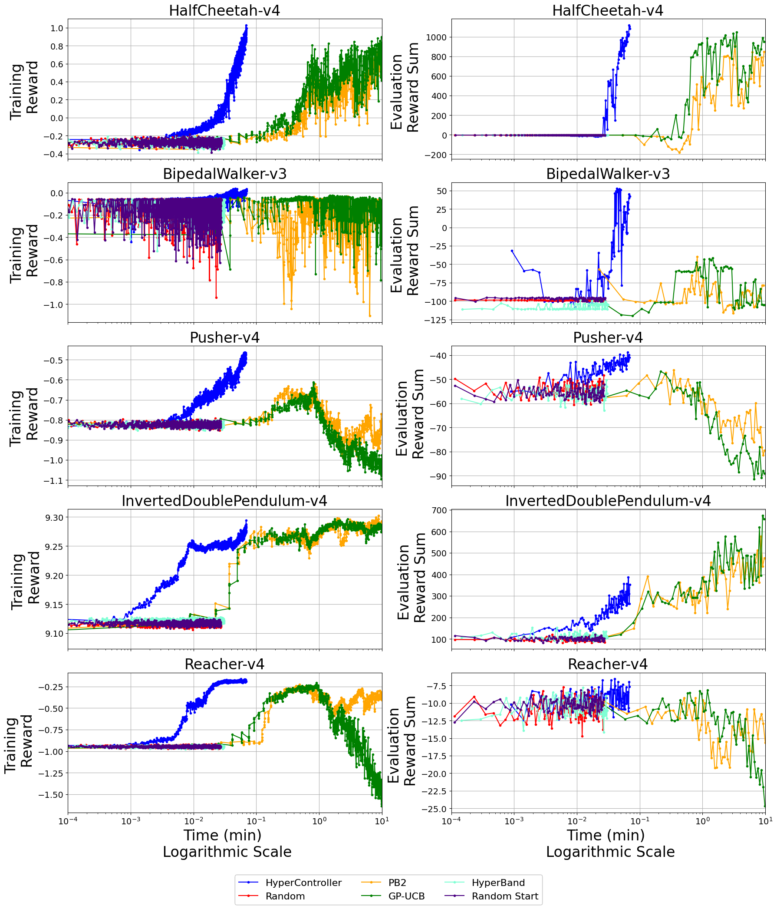

# HyperController

[](https://arxiv.org/abs/2504.19382)
[](./LICENSE)
[](https://www.python.org/downloads/release/python-31111/)
[](https://docs.conda.io/)

[](#)

HyperController is an online hyperparameter optimization algorithm (an area within automated machine learning) for Reinforcement Learning (RL). It configures hyperparameter configurations dynamically while the neural network is still training, enabling efficient and robust neural network performance.

This repository is code for the research paper published on [arXiv](https://arxiv.org/abs/2504.19382), coauthored by Jonathan Gornet, Yiannis Kantaros, and Bruno Sinopoli. 

**Keywords**: AutoML, hyperparameter tuning, reinforcement learning, LLMs, generative AI, control theory, bandits, PyTorch

## Overview

HyperController is tested on OpenAI Gymnasium environments and compared to state-of-the-art hyperparameter optimization methods:

- [PB2 (Population-Based Bandits)](https://proceedings.neurips.cc/paper_files/paper/2020/file/c7af0926b294e47e52e46cfebe173f20-Paper.pdf)
- [GP-UCB (Gaussian Process Upper Confidence Bound)](https://icml.cc/Conferences/2010/papers/422.pdf)
- [HyperBand](https://jmlr.org/papers/volume18/16-558/16-558.pdf)
- [Random](https://dl.acm.org/doi/pdf/10.5555/2188385.2188395)

It provides robust, online tuning without requiring stopping or restarting the training process.

## Installation

A Conda environment file is included for easy setup.

```bash
conda env create -f environment.yml
conda activate automl
```

> **Note**: Conda is required for setting up the environment at this time.

## Running Tests

To verify that the repository's dependencies are running correctly, run the following script: 

```bash
pytest tests/test_imports.py
```

## Usage

To run experiments with HyperController across all supported environments:

```bash
bash run_tests.sh
```

If needed, make the script executable first:

```bash
chmod +x run_tests.sh
```

This script automates training using HyperController and logs results for evaluation. The results are saved in logs.csv (for training results) and eval_logs.csv (for evaluation results). 

## Technologies Used

- Python
- Bash
- Conda
- PyTorch
- OpenAI Gymnasium
- MuJoCo


## Features

- Online hyperparameter optimizer during RL training  
- No need to stop or restart training  
- Benchmark comparisons with top algorithms: PB2, GP-UCB, HyperBand, and Random. We also compare with Random_Start (selects randomly one hyperparameter configuration to use throughout training)
- Simple test script for reproducibility  


## Purpose

Traditionally, engineers must manually tune hyperparameters during neural network training, an expensive process in terms of time and computation ([Garnett *Bayesian Optimization*](https://bayesoptbook.com/)). Prior research has shown that Reinforcement Learning (RL) neural networks are particularly sensitive to these hyperparameters ([Schulman et al., 2017](https://arxiv.org/pdf/1707.06347)).

HyperController addresses this by introducing an automated, online hyperparameter optimizer that adjusts hyperparameters during training, reducing experimentation time.

Its key feature is efficiency: it completes tuning for all steps \( `t = 1,..,1000` \) in under 0.1 minutes. The plot below demonstrates this performance for various OpenAI Gymnasium environments. 

<p align="center">
  
</p>


## Testing Status

The code is currently undergoing validation to ensure full compatibility with all environments and dependencies.

If you encounter any issues, please check that you have correctly installed all packages using the provided `environment.yml` file. 

## License

This project is licensed under the MIT License. See the [LICENSE](./LICENSE) file for details.


## Author

Developed by [Jonathan Gornet](https://jonathangornet.com)


## Citation

If you use this work, please cite the following:

```bibtex
@article{gornet2024hypercontroller,
    title = {HyperController: Online Hyperparameter Optimization during RL Training},
    author = {Gornet, Jonathan},
    journal = {arXiv preprint arXiv:2504.19382},
    year = {2024},
    url = {https://arxiv.org/abs/2504.19382}
}
```

## Acknowledgments

Parts of the testing framework were adapted from the open-source [Ray Tune](https://docs.ray.io/en/latest/tune/index.html). Citation below:

```bibtex
@article{liaw2018tune,
    title = {Tune: A Research Platform for Distributed Model Selection and Training},
    author = {Liaw, Richard and Liang, Eric and Nishihara, Robert and Moritz, Philipp and Gonzalez, Joseph E and Stoica, Ion},
    journal = {arXiv preprint arXiv:1807.05118},
    year = {2018}
}
```

### Compared Methods

Please also cite the following baseline methods when reproducing or comparing:

**[PB2 (Population-Based Bandits)](https://proceedings.neurips.cc/paper_files/paper/2020/file/c7af0926b294e47e52e46cfebe173f20-Paper.pdf)**  
```bibtex
@inproceedings{NEURIPS2020_c7af0926,
    author = {Parker-Holder, Jack and Nguyen, Vu and Roberts, Stephen J},
    booktitle = {Advances in Neural Information Processing Systems},
    editor = {H. Larochelle and M. Ranzato and R. Hadsell and M.F. Balcan and H. Lin},
    pages = {17200--17211},
    publisher = {Curran Associates, Inc.},
    title = {Provably Efficient Online Hyperparameter Optimization with Population-Based Bandits},
    url = {https://proceedings.neurips.cc/paper_files/paper/2020/file/c7af0926b294e47e52e46cfebe173f20-Paper.pdf},
    volume = {33},
    year = {2020}
}
```

**[GP-UCB (Gaussian Process Upper Confidence Bound)](https://icml.cc/Conferences/2010/papers/422.pdf)**  
```bibtex
@article{srinivas2009gaussian,
    title = {Gaussian process optimization in the bandit setting: No regret and experimental design},
    author = {Srinivas, Niranjan and Krause, Andreas and Kakade, Sham M and Seeger, Matthias},
    journal = {ICML},
    url = {https://icml.cc/Conferences/2010/papers/422.pdf},
    year = {2010}
}
```

**[HyperBand](https://www.jmlr.org/papers/volume18/16-558/16-558.pdf)**  
```bibtex
@article{li2018hyperband,
    title = {Hyperband: A novel bandit-based approach to hyperparameter optimization},
    author = {Li, Lisha and Jamieson, Kevin and DeSalvo, Giulia and Rostamizadeh, Afshin and Talwalkar, Ameet},
    journal = {Journal of Machine Learning Research},
    volume = {18},
    number = {185},
    pages = {1--52},
    url = {https://www.jmlr.org/papers/volume18/16-558/16-558.pdf},
    year = {2018}
}
```

**[Random](https://dl.acm.org/doi/pdf/10.5555/2188385.2188395)**  
```bibtex
@article{bergstra2012random,
    title = {Random search for hyper-parameter optimization},
    author = {Bergstra, James and Bengio, Yoshua},
    journal = {The journal of machine learning research},
    volume = {13},
    number = {1},
    pages = {281--305},
    url = {https://dl.acm.org/doi/pdf/10.5555/2188385.2188395},
    year = {2012},
    publisher = {JMLR. org}
}
```

## Additional Applications

This repository also contains examples for using HyperController for hyperparameter tuning while training Deep Convolutional Generative Adversarial Networks (DCGANs) and fine-tuning Large-Language Models (LLMs) via Low Rank Adaptation (LoRA). 

### DCGANs Example

For using HyperController with DCGANs, using the following command:

```bash
python3 genAI_tests.py --seed 0 \
            --method 'HyperController' \
            --folder 'results' \
            --home_dir='/home/jonathangornet/Documents/' \
            --data_dir='{image_dataset_dir}/celebA/' \
            --dataset='celebA'
```
where ```{image_dataset_dir}``` is the directory location of the ```celebA``` dataset. 

### LLMs Example

For using HyperController while fine-tuning a LLMs via LoRA, using the following command:

```bash
python3 tuning.py --method 'HyperController'
```